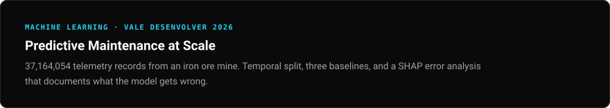
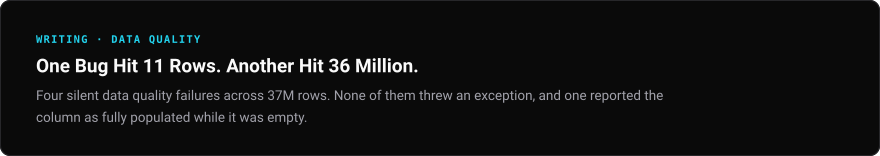
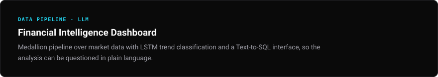
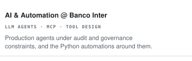
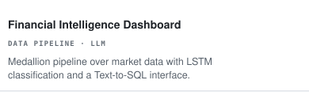
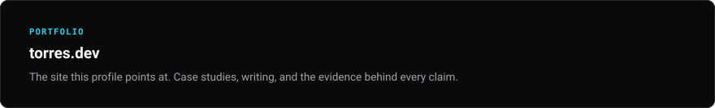

<picture><source media="(max-width: 480px)" srcset="./assets/generated/hero-mobile.svg"></picture>
<picture><source media="(max-width: 480px)" srcset="./assets/generated/status-mobile.svg"></picture>

 

<a href="https://linkedin.com/in/torres-arthur"><picture><source media="(max-width: 480px)" srcset="./assets/generated/contact-linkedin-mobile.svg"></picture></a><a href="mailto:arthuroliveiratorres@gmail.com"><picture><source media="(max-width: 480px)" srcset="./assets/generated/contact-email-mobile.svg"></picture></a><a href="https://github.com/tutorres"><picture><source media="(max-width: 480px)" srcset="./assets/generated/contact-github-mobile.svg"></picture></a><a href="https://torres-dev-ai.vercel.app"><picture><source media="(max-width: 480px)" srcset="./assets/generated/contact-website-mobile.svg"></picture></a>

<picture><source media="(max-width: 480px)" srcset="./assets/generated/featured-header-mobile.svg"></picture>

<a href="https://github.com/tutorres/Vale_Desenvolver"><picture><source media="(max-width: 480px)" srcset="./assets/generated/featured-0-mobile.svg"></picture></a>
<a href="https://torres-dev-ai.vercel.app/articles/data-quality-37m-rows"><picture><source media="(max-width: 480px)" srcset="./assets/generated/featured-1-mobile.svg"></picture></a>
<a href="https://github.com/tutorres/Financial-Intelligence-Dashboard"><picture><source media="(max-width: 480px)" srcset="./assets/generated/featured-2-mobile.svg"></picture></a>

<picture><source media="(max-width: 480px)" srcset="./assets/generated/current-header-mobile.svg"></picture>

<picture><source media="(max-width: 480px)" srcset="./assets/generated/current-0-mobile.svg"></picture>
<picture><source media="(max-width: 480px)" srcset="./assets/generated/current-1-mobile.svg"></picture>
<picture><source media="(max-width: 480px)" srcset="./assets/generated/current-2-mobile.svg"></picture>
<picture><source media="(max-width: 480px)" srcset="./assets/generated/current-3-mobile.svg"></picture>
<a href="https://torres-dev-ai.vercel.app"><picture><source media="(max-width: 480px)" srcset="./assets/generated/current-4-mobile.svg"></picture></a>

<picture><source media="(max-width: 480px)" srcset="./assets/generated/certifications-header-mobile.svg"></picture>

<picture><source media="(max-width: 480px)" srcset="./assets/generated/cert-0-mobile.svg"></picture><picture><source media="(max-width: 480px)" srcset="./assets/generated/cert-1-mobile.svg"></picture><picture><source media="(max-width: 480px)" srcset="./assets/generated/cert-2-mobile.svg"></picture><picture><source media="(max-width: 480px)" srcset="./assets/generated/cert-3-mobile.svg"></picture>

Accessible text version

## Featured work

### [Predictive Maintenance at Scale](https://github.com/tutorres/Vale_Desenvolver)
*MACHINE LEARNING · VALE DESENVOLVER 2026*

37,164,054 telemetry records from an iron ore mine. Temporal split, three baselines, and a SHAP error analysis that documents what the model gets wrong.

### [One Bug Hit 11 Rows. Another Hit 36 Million.](https://torres-dev-ai.vercel.app/articles/data-quality-37m-rows)
*WRITING · DATA QUALITY*

Four silent data quality failures across 37M rows. None of them threw an exception, and one reported the column as fully populated while it was empty.

### [Financial Intelligence Dashboard](https://github.com/tutorres/Financial-Intelligence-Dashboard)
*DATA PIPELINE · LLM*

Medallion pipeline over market data with LSTM trend classification and a Text-to-SQL interface, so the analysis can be questioned in plain language.

## Currently working on

### AI & Automation @ Banco Inter
*LLM AGENTS · MCP · TOOL DESIGN*

Production agents inside a regulated bank. System prompts, tool design and MCP integrations. Nine automations, 1.4 FTE of manual work removed in seven months.

### LLM for Market Prediction
*UNDERGRADUATE RESEARCH · CEFET-MG*

Hybrid models combining financial time series, sentiment extracted by LLMs and constrained portfolio optimization, benchmarked against each approach alone.

### JobFinder
*AGENTIC PIPELINE*

Remote job pipeline that retrieves, scores and explains matches against a profile, built to be measured rather than demoed.

### TMB Scan
*NEXT.JS · REACT · SUPABASE*

Physical assessment platform for a paying client. Structured evaluations turned into professional PDF reports.

### [torres.dev](https://torres-dev-ai.vercel.app)
*PORTFOLIO*

The site this profile points at. Case studies, writing, and the evidence behind every claim.

## Certifications

- **Programa Desenvolver 2026** — Vale · Data Analysis · challenge completed, not placed
- **Lean Six Sigma Yellow Belt** — Thoth / CSSC
- **EF SET English** — C1 · 65/100 · C2 listening
- **Claude Code 101** — Anthropic

<!-- Generated from profile.yml. Edit profile.yml, then run python scripts/build_profile.py. -->
