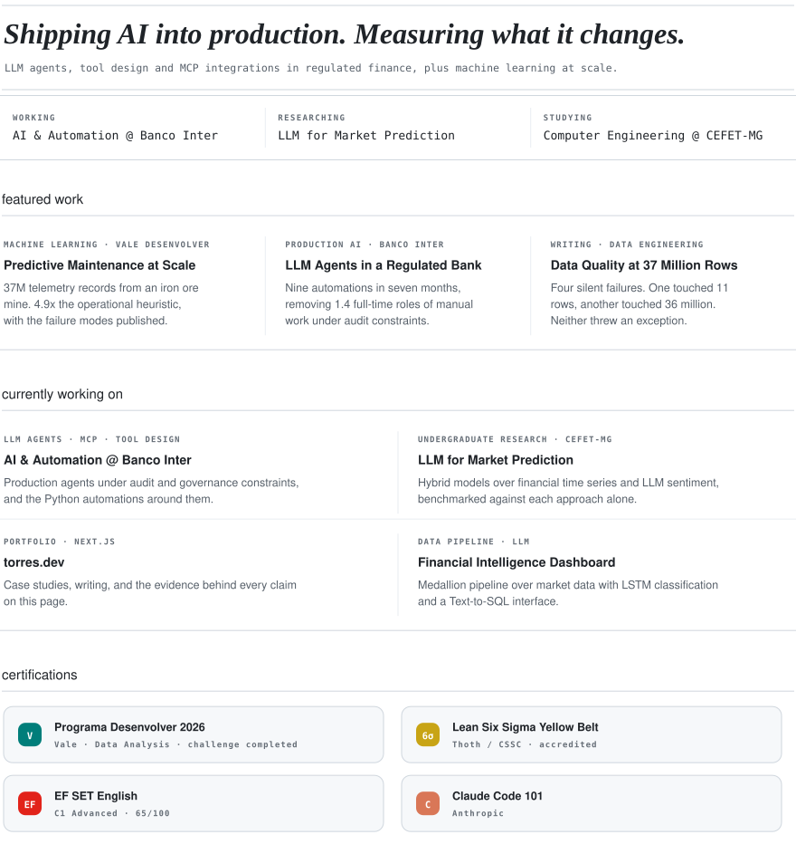

<picture><source media="(max-width: 480px)" srcset="./assets/generated/profile-mobile.svg"></picture>

[Linkedin](https://linkedin.com/in/torres-arthur) · [Email](mailto:arthuroliveiratorres@gmail.com) · [Github](https://github.com/tutorres) · [Website](https://torres-dev-ai.vercel.app)

Accessible text version

## featured work

### [Predictive Maintenance at Scale](https://github.com/tutorres/Vale_Desenvolver)
*MACHINE LEARNING · VALE DESENVOLVER*

37M telemetry records from an iron ore mine. 4.9x the operational heuristic, with the failure modes published.

### [Data Quality at 37 Million Rows](https://torres-dev-ai.vercel.app/articles/data-quality-37m-rows)
*WRITING · DATA ENGINEERING*

Four silent failures. One touched 11 rows, another touched 36 million. Neither threw an exception.

## currently working on

### AI & Automation @ Banco Inter
*LLM AGENTS · MCP · TOOL DESIGN*

Production agents under audit and governance constraints, and the Python automations around them.

### Hybrid LLM Models for Market Prediction and Financial Risk Management
*UNDERGRADUATE RESEARCH · CEFET-MG*

Hybrid models over financial time series and LLM sentiment, benchmarked against each approach alone.

### [torres.dev](https://torres-dev-ai.vercel.app)
*PORTFOLIO · NEXT.JS*

Case studies, writing, and the evidence behind every claim on this page.

### [Financial Intelligence Dashboard](https://github.com/tutorres/Financial-Intelligence-Dashboard)
*DATA PIPELINE · LLM*

Medallion pipeline over market data with LSTM classification and a Text-to-SQL interface.

## certifications

- **Programa Desenvolver 2026**: Vale · Data Analysis · challenge completed
- **Lean Six Sigma Yellow Belt**: Thoth / CSSC · accredited
- **EF SET English**: C1 Advanced · 65/100
- **Claude Code 101**: Anthropic

<!-- Generated from profile.yml. Edit profile.yml, then run python scripts/build_profile.py. -->
