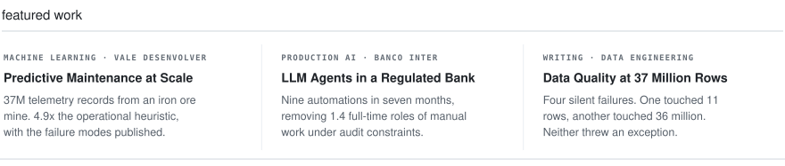
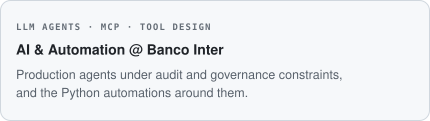
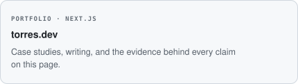
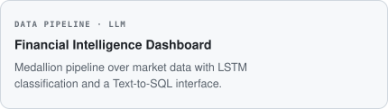

<picture><source media="(max-width: 480px)" srcset="./assets/generated/hero-mobile.1b9c6bdd.svg"></picture>
<picture><source media="(max-width: 480px)" srcset="./assets/generated/status-mobile.2dbbc461.svg"></picture>

 

<a href="https://linkedin.com/in/torres-arthur"><picture><source media="(max-width: 480px)" srcset="./assets/generated/contact-linkedin-mobile.f90dc20f.svg"></picture></a><a href="mailto:arthuroliveiratorres@gmail.com"><picture><source media="(max-width: 480px)" srcset="./assets/generated/contact-email-mobile.de671a30.svg"></picture></a><a href="https://github.com/tutorres"><picture><source media="(max-width: 480px)" srcset="./assets/generated/contact-github-mobile.663b3e07.svg"></picture></a><a href="https://torres-dev-ai.vercel.app"><picture><source media="(max-width: 480px)" srcset="./assets/generated/contact-website-mobile.59a6b871.svg"></picture></a>

<picture><source media="(max-width: 480px)" srcset="./assets/generated/featured-mobile.4b3ff599.svg"></picture>

<picture><source media="(max-width: 480px)" srcset="./assets/generated/current-header-mobile.cb5502e2.svg"></picture>

<picture><source media="(max-width: 480px)" srcset="./assets/generated/current-0-mobile.5895d5d0.svg"></picture><picture><source media="(max-width: 480px)" srcset="./assets/generated/current-1-mobile.ba2d13e3.svg"></picture><a href="https://torres-dev-ai.vercel.app"><picture><source media="(max-width: 480px)" srcset="./assets/generated/current-2-mobile.30682437.svg"></picture></a><a href="https://github.com/tutorres/Financial-Intelligence-Dashboard"><picture><source media="(max-width: 480px)" srcset="./assets/generated/current-3-mobile.391b84e4.svg"></picture></a>

<picture><source media="(max-width: 480px)" srcset="./assets/generated/certifications-header-mobile.3467fac9.svg"></picture>

<picture><source media="(max-width: 480px)" srcset="./assets/generated/cert-0-mobile.8d4f9580.svg"></picture><picture><source media="(max-width: 480px)" srcset="./assets/generated/cert-1-mobile.572ae073.svg"></picture><picture><source media="(max-width: 480px)" srcset="./assets/generated/cert-2-mobile.1d0f1e6c.svg"></picture><picture><source media="(max-width: 480px)" srcset="./assets/generated/cert-3-mobile.7129759b.svg"></picture>

Accessible text version

## featured work

### [Predictive Maintenance at Scale](https://github.com/tutorres/Vale_Desenvolver)
*MACHINE LEARNING · VALE DESENVOLVER*

37M telemetry records from an iron ore mine. 4.9x the operational heuristic, with the failure modes published.

### LLM Agents in a Regulated Bank
*PRODUCTION AI · BANCO INTER*

Nine automations in seven months, removing 1.4 full-time roles of manual work under audit constraints.

### [Data Quality at 37 Million Rows](https://torres-dev-ai.vercel.app/articles/data-quality-37m-rows)
*WRITING · DATA ENGINEERING*

Four silent failures. One touched 11 rows, another touched 36 million. Neither threw an exception.

## currently working on

### AI & Automation @ Banco Inter
*LLM AGENTS · MCP · TOOL DESIGN*

Production agents under audit and governance constraints, and the Python automations around them.

### LLM for Market Prediction
*UNDERGRADUATE RESEARCH · CEFET-MG*

Hybrid models over financial time series and LLM sentiment, benchmarked against each approach alone.

### [torres.dev](https://torres-dev-ai.vercel.app)
*PORTFOLIO · NEXT.JS*

Case studies, writing, and the evidence behind every claim on this page.

### [Financial Intelligence Dashboard](https://github.com/tutorres/Financial-Intelligence-Dashboard)
*DATA PIPELINE · LLM*

Medallion pipeline over market data with LSTM classification and a Text-to-SQL interface.

## certifications

- **Programa Desenvolver 2026**: Vale · Data Analysis · challenge completed
- **Lean Six Sigma Yellow Belt**: Thoth / CSSC · accredited
- **EF SET English**: C1 Advanced · 65/100
- **Claude Code 101**: Anthropic

<!-- Generated from profile.yml. Edit profile.yml, then run python scripts/build_profile.py. -->
